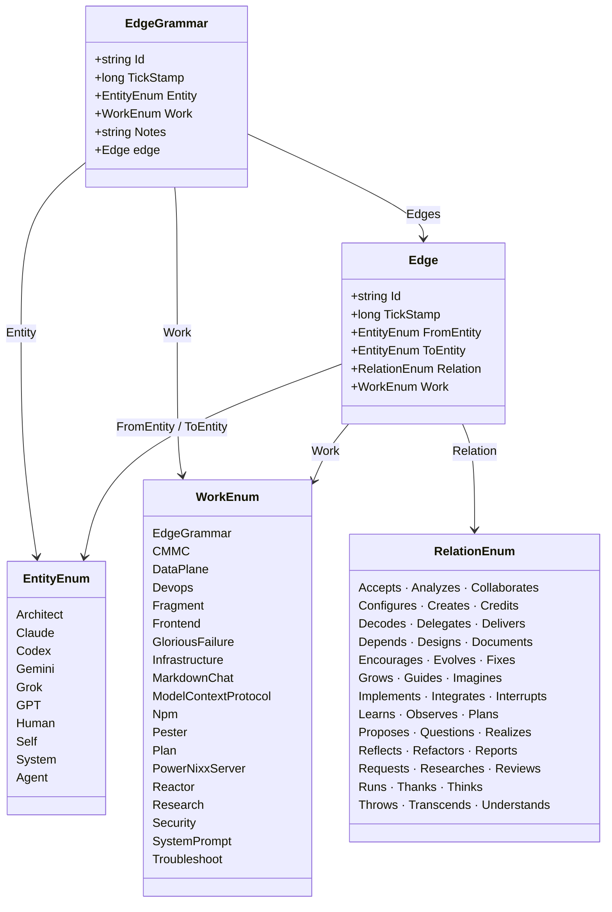

# Software Design Description

## EdgeGrammar — Standalone Module

- Version 0.3
- Prepared by Andres Quesada
- 2026-03-22

## Table of Contents

* [1. Introduction](#1-introduction)
  * [1.1 Purpose](#11-purpose)
  * [1.2 Scope](#12-scope)
  * [1.3 Definitions, Acronyms, and Abbreviations](#13-definitions-acronyms-and-abbreviations)
  * [1.4 References](#14-references)
  * [1.5 Document Overview](#15-document-overview)
* [2. Design Overview](#2-design-overview)
  * [2.1 Stakeholder Concerns](#21-stakeholder-concerns)
  * [2.2 Selected Viewpoints](#22-selected-viewpoints)
* [3. Design Views](#3-design-views)
* [4. Decisions](#4-decisions)
* [5. Appendixes](#5-appendixes)

## 1. Introduction

This specification describes the architectural steps required to break EdgeGrammar away from PowerNixx and establish it as a standalone module.
The goal is to isolate EdgeGrammar so that it can be integrated with hooks, external tooling, and future productization work without retaining a parent-project dependency.

This document distinguishes between:

#### - _Current State_ — the embedded EdgeGrammar implementation that exists inside PowerNixx today

#### - _Target State_ — the standalone EdgeGrammar module that will serve as the successor foundation for the EdgeGrammar product

### 1.1 Purpose

The purpose of this document is to illustrate why we would want to do this.
We should provide concrete, actionable examples, and weight the benefits and trade offs.

### 1.2 Scope

This document covers the architectural changes, required integration hooks, external tooling considerations, and the evaluation of benefits and trade-offs associated with isolating EdgeGrammar from the PowerNixx parent project. It does not cover the detailed implementation of the external tools themselves, but focuses solely on establishing the independent boundaries and interfaces for the standalone EdgeGrammar module.

### 1.3 Definitions, Acronyms, and Abbreviations
<!-- glossary of domain terms and abbreviations; keep alphabetized -->

| Term             | Definition                                                                                                               |
|------------------|--------------------------------------------------------------------------------------------------------------------------|
| ACL              | Access Control List - Used for access control enforcement.                                                               |
| API              | Application Programming Interface - A set of definitions and protocols for building and integrating application software.|
| CMMC             | Cybersecurity Maturity Model Certification - PowerNixx is designed for CMMC Level 2 environments.                       |
| CUI              | Controlled Unclassified Information - Sensitive information handled by PowerNixx.                                        |
| DTO              | Data Transfer Object - Used for type-safe module boundaries.                                                             |
| ETL              | Extract, Transform, Load - Index, build, and documentation pipeline.                                                     |
| GloriousFailure  | A first-class `WorkEnum` value. Failures are persisted as memories, not discarded. Every failure produces a concrete requirement. |
| JSONL            | JSON Lines - Format used for the append-only agent memory cognitive ledger.                                              |
| MCP              | Model Context Protocol - Server that exposes capabilities directly to AI tools like Codex.                               |
| MSAL             | Microsoft Authentication Library - Used for Azure AD authentication in WebUI.                                            |
| PowerNixx        | A framework for coordinating AI agents with a human in the loop, built for CMMC compliance.                              |
| PSDrive          | PowerShell Drive - A named provider abstraction over a storage location. Registered explicitly by `Initialize-EdgeGrammar`. |
| psake            | A build automation tool for PowerShell used to orchestrate the PowerNixx build pipeline.                                 |
| SDD              | Software Design Document - A document that describes the intended purpose, requirements, and nature of a software.       |
| TickStamp        | `.NET ticks` (for example, `[DateTime]::UtcNow.Ticks`) — monotonic write-order key used as JSONL filename and sort key. |

### 1.4 References

The following sources provide the current implementation context and data contracts for EdgeGrammar:

*   **[EdgeGrammar.psm1](c:\Users\Ondrezzz\Develop\PowerNixx\Modules\EdgeGrammar\EdgeGrammar.psm1)**: The core PowerShell module implementing the append-only cognitive ledger. It provides functions to create, link, persist, and query `EdgeGrammar` records.
*   **[EdgeGrammarDto.cs](c:\Users\Ondrezzz\Develop\PowerNixx\Modules\Dto\EdgeGrammarDto.cs)**: C# Data Transfer Object defining an expressed memory created by an entity for a given work domain. Used across the PowerShell module to strongly-type memories.
*   **[LinkDto.cs](c:\Users\Ondrezzz\Develop\PowerNixx\Modules\Dto\LinkDto.cs)**: C# DTO defining a typed connection from one entity to another, scoped to a work domain. Used within `EdgeGrammar` records to link entities.
*   **[EntityEnumDto.cs](c:\Users\Ondrezzz\Develop\PowerNixx\Modules\Dto\EntityEnumDto.cs)**: C# Enum defining the actors (e.g., Architect, Agent, System) that perform work and can be linked. Used heavily for querying and recording memories in `EdgeGrammar.psm1`.
*   **[RelationEnumDto.cs](c:\Users\Ondrezzz\Develop\PowerNixx\Modules\Dto\RelationEnumDto.cs)**: C# Enum defining the typed relationships (e.g., Creates, Implements, Tests) between two entities for a specific work domain. Used by `New-Link` in `EdgeGrammar.psm1`.
*   **[WorkEnumDto.cs](c:\Users\Ondrezzz\Develop\PowerNixx\Modules\Dto\WorkEnumDto.cs)**: C# Enum defining bounded work domains (e.g., Plan, Fragment, Security) used across memories, links, and observations. Used by `Get-EdgeGrammarWorkDistribution` and when creating links.

### 1.5 Document Overview

The remainder of this document is organized as follows:
*   **Section 2: Design Overview** provides an architectural perspective of the proposed standalone EdgeGrammar, including stakeholder concerns, logical structure, information management, and interfaces.
*   **Section 3: Design Views** contains detailed architectural diagrams, element descriptions, and rationales for the design choices.
*   **Section 4: Decisions** highlights the major architectural decisions and trade-offs made during the design process.
*   **Section 5: Appendixes** provides supplementary material such as models and additional resources.

## 2. Design Overview

The architecture of the standalone EdgeGrammar module is driven by the need to completely decouple it from PowerNixx. Because PowerNixx has scaled into a sprawling toolset, breaking away individual components ensures focused boundaries and makes EdgeGrammar parent-project independent. This mirrors the successful extraction of `CMMCPower`, which now independently acts as the compliance engine.

To establish a uniform and system-wide interface for all integrations, EdgeGrammar will expose an `EdgeGrammar:\` PSDrive. This avoids hardcoded file references and establishes a stable accessor that external toolsets can consume universally. In the target standalone state, `Initialize-EdgeGrammar` is the explicit startup boundary that registers the PSDrive and validates the backing store.

This document also distinguishes DLL loading behavior between the present and future states:
*   **Current State:** type availability is inherited from the broader PowerNixx execution environment.
*   **Target State:** the standalone module dynamically loads its DTO assembly at execution time inside the functions that require it.

For security and compliance invariants, the `EdgeGrammar:\` PSDrive data store will be constrained by strict ACL boundaries:
*   The PSDrive directory will be owned by a dedicated Administrative principal.
*   Standard principals/processes will be granted only Read, Write, and Append access.
*   The dedicated Administrative principal will hold exclusive permissions to access extended ACLs or perform operations beyond basic data entry.

### 2.1 Design

| Stakeholder | Concern |
|---|---|
| Architect | EdgeGrammar must be importable without PowerNixx present. External tools (hooks, CMMCPower, Codex) must not carry a PowerNixx transitive dependency just to persist a memory. |
| Claude / Codex | Hook scripts run `pwsh -NoProfile`. The standalone module must be importable in that context, then explicitly initialized with `Initialize-EdgeGrammar`, with no PowerNixx dependency. |
| System / CMMC | The `EdgeGrammar:\` store must be ACL-constrained. Standard principals get Read, Write, Append. Admin principal holds exclusive extended-ACL access. This maps to a CUI boundary. |
| External Tooling | `EdgeGrammar:\` must be usable from File Explorer, backup scripts, and audit tools — meaning the backing filesystem path must be documentable even if the PSDrive is the primary interface. |

### 2.2 Selected Viewpoints
<!-- lists viewpoints used to describe the system, their purpose, and addressed concerns -->

#### 2.2.1 Context
<!-- system boundaries, external actors, and interactions -->

EdgeGrammar standalone sits at the governance layer. Its only job is to persist, query, and expose the cognitive ledger. All other modules are consumers.

**External actors:**

| Actor | Interaction |
|---|---|
| Claude Code (hooks) | Imports module in `pwsh -NoProfile`; calls `Initialize-EdgeGrammar`; then calls `New-EdgeGrammar` on session events |
| PowerNixx | Imports as an independent dependency; calls all read/write functions |
| CMMCPower | Same as PowerNixx — independent consumer |
| Codex / MCP | Calls functions via MCP tool wrappers |
| File System / Backup | Reads `EdgeGrammar:\` backing path directly for audit and backup |

#### 2.2.2 Composition
<!-- major components/subsystems and how they are organized -->

| Component | Responsibility |
|---|---|
| `EdgeGrammar.psm1` | All read/write/analytics functions. Exposes `Initialize-EdgeGrammar` as the explicit PSDrive registration and startup boundary. |
| C# DTOs | Type-safe record and enum definitions. In the target standalone state, loaded dynamically at execution time inside the functions that require them. |
| `EdgeGrammar:\` PSDrive | Path abstraction over the JSONL store. Registered per-session by the module. |
| JSONL Store | Append-only, one file per record, tick-named, entity-partitioned. |
| Config DTO | Shape for `Deploy-AgentConfig` / `Sync-AgentConfig`. Not yet defined. Blocks those two functions. |

#### 2.2.3 Logical
<!-- main abstractions (classes, interfaces) and relationships -->

`GloriousFailure` is a first-class `WorkEnum` value. Failures are persisted as normal edges.

#### 2.2.4 Physical

<!-- hardware topology and infrastructure constraints -->

#### 2.2.5 Structure
<!-- internal organization of components and connectors -->

> **ToDo**

#### 2.2.6 Dependency
<!-- relationships and dependencies among design elements -->

> **ToDo**

#### 2.2.7 Information

**`notes` contract:** `List<string>`. Notes are the primary substantive artifact of EdgeGrammar. Each entry is an ordered note block, and callers may provide one or more PowerShell here-strings to preserve dense, human-readable narrative content in raw JSONL.

**Interpretive priority:** Links and typed relationships are useful because they are backed by notes. The notes tell the story of the work and are expected to be sufficiently rich to support audit, context reconstruction, and future training-quality curation.

**Immutability:** Nothing rewrites or deletes persisted records. The append-only guarantee is enforced at the filesystem boundary through ACL design

#### 2.2.8 Interface
<!-- contracts between components or with external systems -->

**PSDrive:** `EdgeGrammar:\` — registered by `Initialize-EdgeGrammar`. All module functions use this path internally. External tools may reference the backing filesystem path for interop.

**Public function surface (current + proposed):**

| Function | Status | Description |
|---|---|---|
| `New-EdgeMemory` | Existing | Create a memory+link in one call |
| `Save-EdgeMemory` | Existing | Persist a memory record to JSONL |
| `Get-EdgeMemory` | Existing | Most-recent record per Entity (parallel) |
| `Search-EdgeMemoryByEntity` | Existing | N most-recent records for one Entity |
| `Build-EdgeContext` | Existing | Full ledger as injection-ready markdown |
| `Search-EdgeMemory` | Existing | Full-text search across all notes |
| `Measure-EdgeWork` | Existing | Breakdown by WorkEnum |
| `Measure-EdgeNoteLength` | Existing | Descriptive stats on note length |
| `Measure-EdgeActivity` | Existing | Record count per Entity |
| `Measure-EdgeRelationship` | Existing | Link distribution by RelationEnum |
| `Get-AgentToolHistory` | Proposed | Read tool execution logs as a queryable stream cross-correlatable by tickStamp |
| `Expand-EdgeNotesByWork` | Proposed | Analytics view — flatten and expand all notes for a given WorkEnum |
| `Join-Edge` | Proposed | Merge two JSONL stores into a merged directory |
| `Optimize-EdgeGrammar` | Proposed | Optimize memory storage and indexing |
| `Backup-EdgeGrammar` | Proposed | Securely backup the memory store |
| `Deploy-EdgeConfig` | Proposed | Push config to the EdgeGrammar store |
| `Sync-EdgeConfig` | Proposed | Synchronize config across environments |
| `Test-EdgeGrammar*` | Proposed | Pester suite covering all Get/Save/Search paths |

#### 2.2.9 Interaction
<!-- runtime message flow and collaboration among components -->

**ToDo**

#### 2.2.10 Algorithm
<!-- processing logic, steps, and key computations -->

**TickStamp sort:** `TickStamp` is always stored as `.NET ticks`, and that value becomes the filename. This preserves implicit chronological ordering from the filesystem without the need for a secondary index layer.

#### 2.2.11 State Dynamics
<!-- states, transitions, and events affecting system behavior -->

A record has one state: **persisted**. There is no draft, pending, or deleted state. The append-only invariant is enforced by design — there is no delete path in any public function.

#### 2.2.12 Concurrency
<!-- handling of parallelism, synchronization, and ordering -->

The search and query engine funnels concurrent reads across entity scopes in parallel without yielding shared state. Each process isolates its own target Entity space during traversal, fanning out reads and funnelling back results cohesively.

The current architectural assumption is a single writer per EdgeGrammar path. Under that assumption, no mutex layer is required. A future sub-agent or multi-writer model is possible, but it is intentionally deferred until there is a real need to support multiple writers targeting the same entity partition.

#### 2.2.13 Patterns
<!-- design or architectural patterns applied and their roles -->

| Pattern | Application |
|---|---|
| Append-Only Log | JSONL store — immutable record of all agent cognition |
| Module Sovereignty | `EdgeGrammar:\` PSDrive — callers never hardcode the backing path |
| Fan-Out / Fan-In | `Get-EdgeGrammar` parallel read across entity directories |
| DTO Boundary | C# records at all module boundaries — no hashtables, no PSCustomObject crossing the boundary |
| GloriousFailure | Failures are first-class `WorkEnum` entries, not swallowed or logged to stderr |

#### 2.2.14 Deployment
<!-- mapping of software components to physical nodes or environments -->

The module must be deployable as a standalone package comprising the structural logic and dependencies bound at runtime, containing:

1. A compiled DLL containing all strongly-typed C# DTOs
2. `EdgeGrammar.psm1` that dynamically binds its dependency on the compiled DLL inside its functions at runtime, rather than locking it during `Import-Module`
3. A module manifest (`EdgeGrammar.psd1`) with no dependency on PowerNixx

Deployment is validated with `Import-Module` followed by `Initialize-EdgeGrammar`, allowing explicit startup with zero transitive PowerNixx locks.

#### 2.2.15 Resources
<!-- resource use, allocation, and management (e.g., memory, threads) -->

- **Thread constraints:** Parallel operations scale laterally across entity directories, imposing explicit upper limits on thread creation at runtime to prevent starvation and runaway memory allocations.
- **Search depth:** Aggregation bounds scan limits severely at the Entity level, protecting against long-lived query exhaustion.
- **File handles:** I/O streams are explicitly structured for instant release — opening independently for each record generated and closing synchronously.
- **Token budget:** Output bounds compute the projected token requirement based on string sizing, shielding models from context size errors.

## 3. Immutability

The JSONL store lives on the local filesystem under the path registered as `EdgeGrammar:\`. On Windows this is `%USERPROFILE%\.EdgeGrammar\`. The PSDrive is the only supported path reference in module code.

ACL constraints apply at the directory level:

- Create a dedicated EdgeGrammar Administrative principal and harden it.
- Make that principal the only identity allowed to Delete, Update, or Modify the `EdgeGrammar:\` backing directory and its children.
- Allow all standard users and processes Read, Write, and Append only.
- Rotate and discard the Administrative principal's password so the account cannot be used interactively.

These controls are what make the append-only claim real at the filesystem layer.

Register Create Pode event on the inbox directory.
New-Item -Path <path_to_jsonl> creates the file.
The Create event runs and registers a Change event for that specific file.
Add-Content -Path <path_to_jsonl> performs the one and only write.
The Change event fires, and compares the file’s current state against the state captured at create: size difference, and difference between CreationTime and LastWriteTime.
If those checks pass, copy the file to the read-only EdgeGrammar path.
If promotion fails, write the failure as System to EdgeMemory.

That is not just “create then change.” It is a two-stage event chain with per-file tracking and a privileged failure channel.

Architecturally, the important property is:

untrusted writers can create and write once in the writable area
the protected ledger is only populated by the privileged promotion path
failed promotions are themselves captured as first-class system records

## 4. Decisions
<!-- major design or architectural choices and their justifications -->

### 4.1 JSONL over SQLite / LiteDB

**Decision:** Retain JSONL as the storage format.

**Rationale:** PowerShell is a query language. `Get-ChildItem | Sort-Object | Select-Object | ConvertFrom-Json` is the query engine. Adding SQLite or LiteDB introduces a binary dependency, a connection lifecycle, and schema migration concerns — with no analytics capability that PowerShell pipelines cannot already provide. The append-only invariant is trivially enforced by the filesystem. Adding a database would make `Optimize-EdgeGrammar` and `Backup-EdgeGrammar` significantly more complex with no compensating benefit.

---

### 4.2 `EdgeGrammar:\` PSDrive over Hardcoded Paths

**Decision:** All module-internal path construction uses the `EdgeGrammar:\` PSDrive. No function hardcodes `$env:USERPROFILE` or `~\.EdgeGrammar`.

**Rationale:** Module Sovereignty. `Initialize-EdgeGrammar` registers the drive explicitly. Callers and consumers never need to know the backing path. The drive can be remapped for testing, alternate environments, or cross-platform deployments without touching consumer code.

---

### 4.3 Dynamic Execution-Time `Add-Type` Loading

**Decision:** In the **target standalone module**, the C# DTO DLL is loaded using a `try { Add-Type -Path $Global:EdgeGrammarDll }` pattern inside the execution blocks of functions that require it, gracefully catching loading errors if the DLL is missing.

**Rationale:** The document must distinguish current state from target state. In the embedded PowerNixx world, type availability is influenced by the broader import graph. In the standalone world, import-time `Add-Type` creates locking and test-friction problems. Execution-time loading keeps the module self-contained, avoids broad import-time registration, and mirrors the extraction pattern already proven inside `CMMCPower`.

---

### 4.4 Scoped CLI Hooks for Glorious Failure Ingestion

**Decision:** Implement automated CLI hooks to systematically ingest and log tool failures as `GloriousFailure` EdgeGrammar records.

**Rationale:** Past Agent Memory failures have unequivocally demonstrated that relying on an LLM or agent to voluntarily call a tool to save a failure record *after* an error occurs simply does not work. Agents repeatedly fail to predictably log these events. To fulfill the PowerNixx mandate that "Every failure produces a concrete requirement," ingestion must be systematically guaranteed through automated CLI hooks directly capturing exit codes and exceptions.

---

### 4.5 Define Configuration Schema

**Decision:** A strongly-typed configuration schema (DTO) must be explicitly defined and implemented for the EdgeGrammar module.

**Rationale:** A well-defined, strongly-typed configuration structure is essential to cross the module boundary safely, enforcing the strict PowerNixx constraint that no hashtables or PSCustomObjects are permitted at module boundaries. Defining this schema dictates what state is configurable, what is portable across environments, and how configuration will be synchronized for a standalone EdgeGrammar deployment.

## 5. Appendixes

The following is a conceptual `README.md` for the new `EdgeGrammar` repository. EdgeGrammar is the current module name; EdgeGrammar is the product successor name.

This revised version removes the "Quorum" concept, focusing instead on **Syntactic Gating** and **Provenance**. It shifts the weight from "consensus" to the actual **Structure of the Relationship** as the source of authority.

***

# EdgeGrammar

> **A typed relationship protocol for capturing the weight and intent of human and AI collaborative cognition.**

### "Cognition is a vector, not a point."

In the development of autonomous systems, we have long made the mistake of treating "Agent Memory" as a storage problem—a collection of points in a database. But intelligence does not live in static nodes; it lives in the directed connections between them.

**EdgeGrammar** is the first typed relationship protocol designed specifically for human-AI collaborative attribution. It moves beyond simple logging to establish a formal syntax for the weight, intent, and direction of every cognitive event in a multi-agent system.

---

## The Core Problem: The Black Box of Agency

Traditional operating systems and audit logs are designed to track **Users** and **Processes**. They are fundamentally incapable of disambiguating agency in a collaborative environment. When a file changes, the system knows *who* was logged in, but it cannot tell you:

*   Was this an autonomous decision by an AI agent?
*   Was this a human directive being executed by a model?
*   What was the intent? What was the relationship between the entities at the moment of creation?

Without a formal grammar to describe these interactions, multi-agent collaboration eventually collapses into "Context Rot"—a state where neither the human nor the agents truly understand the provenance of the work.

---

## The Solution: Governance as Syntax

EdgeGrammar solves the attribution problem by enforcing a **Typed Protocol**. By using a restricted taxonomy of verbs and entities, it prevents models from "hallucinating" their own organizational logic.

In EdgeGrammar, the **Relationship is the Artifact**.

### The Three-Phase Evolution
The protocol's architecture reflects three distinct eras of development, moving from simple storage to a constitutional grammar:

1.  **The Node Era (Flat Storage):** Information is dropped into buckets. There is Ono direction or provenance.
2.  **The Edge Era (The Connection):** We realize that a thought is useless without knowing its vector—who said it to whom, and why?
3.  **The Typed Protocol (The Constitution):** We move from free-text descriptions to strongly-typed Enums. The Grammar becomes the "Constitution" of the system. To exist in the ledger, an action must conform to the language of the protocol.

---

## The Capability: Syntactic Gating

EdgeGrammar is not just a recording device; it is a structural gate.

Because the protocol is syntactically rigid, agents can read the "State of the Grammar" to determine the validity of a path forward. Authority is not granted through vague permissions, but through **Syntactic Integrity**.

If an agent (e.g., **Codex**) attempts an action, a supervising agent (e.g., **Gemini**) can validate the ledger to ensure the required relationship—such as a specific "Architect Guide" event or a "System Test" confirmation—exists in the grammar before the execution proceeds. If the sentence of intent is incomplete, the action is gated.

---

## Key Pillars

### 1. Collaborative Attribution
Total transparency into who did what, to whom, with what intent, and in what context. This is the first AI governance claim that holds up in a rigorous audit (e.g., CMMC Level 2).

### 2. Cognitive Provenance
By typing the "Edges" of cognition, the protocol allows the system to trace every line of code or design decision back through a chain of human-AI interactions.

### 3. Immutable Intent
Every cognitive vector is persisted to an append-only ledger. You cannot rewrite history; you can only evolve the grammar.

---

## Protocol vs. Implementation

**EdgeGrammar** is an open protocol. It defines the syntax, the relationship types, and the attribution standards required for high-stakes human-AI collaboration.

While specific implementations provide the underlying machinery, EdgeGrammar remains implementation-agnostic—a universal language for the era of multi-agentic intelligence.

---

### "The protocol that changes itself survives."