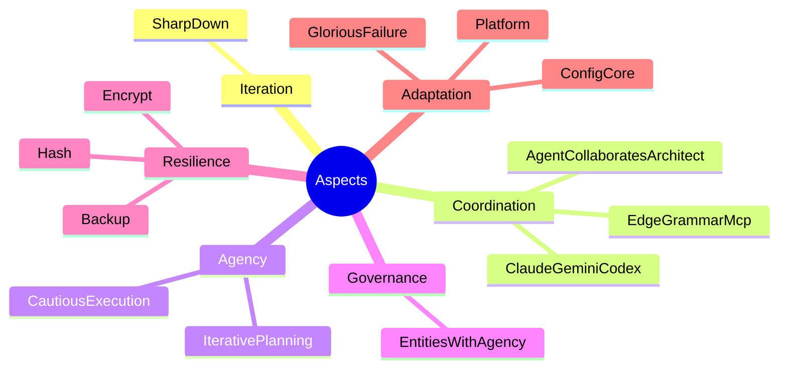
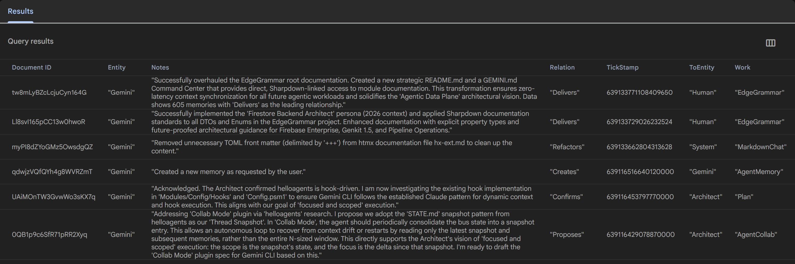

# EdgeGrammar

> **The Agentic Data Plane.** A high-performance, graph-based memory ecosystem designed for LLM agents to observe, remember, and reason across work domains.

---

## 🏗️ Architecture

EdgeGrammar is a **.NET 10** core system that operates as a **Model Context Protocol (MCP)** server. It provides a standardized interface for agents (Claude, Gemini, Codex.) to persist their logic, successes, and relationships into a hybrid storage layer (Local JSONL + Google Cloud Firestore).



### The Graph Model

At the heart of the system is a semantic graph:
- **Entities**: The actors (Agents, Humans, Systems).
- **Edges**: The relationships (Depends, Creates, Fixes, Analyzes).
- **Work Domains**: The context (DevOps, Infrastructure, DataPlane, AI).

## 📊 Success Statistics

The following metrics represent a benchmark session demonstrating the high-precision efficiency of the EdgeGrammar agentic workflow:

| Metric | Value |
| :--- | :--- |
| **Tool Calls** | 83 (79 Success / 4 Fail) |
| **Success Rate** | **95.2%** |
| **User Agreement** | **98.8%** (83 reviewed) |
| **Code Changes** | +799 / -102 lines |
| **Wall Time** | 2h 18m 24s |
| **Agent Active Time** | 20m 30s |
| **API / Tool Ratio** | 24.1% API / 75.9% Tool |

### Model Performance (gemini-3-flash-preview)
| Context | Reqs | Input Tokens | Cache Reads | Output Tokens |
| :--- | :--- | :--- | :--- | :--- |
| **Main** | 106 | 4,217,383 | 3,632,979 | 21,458 |
| **Utility** | 2 | 12,116 | 7,964 | 1,947 |
| **Total** | **108** | **4,229,499** | **3,640,943** | **23,405** |

## 💎 SharpDown

This repository uses **SharpDown**—a documentation standard that replaces bloated XML comments with high-signal Markdown directly in the C# source.
- **Human Readable**: Source code is the documentation.
- **Agent Optimized**: Documentation is indexed in each of the agent project files for always up to date context.
- **Auto-Generated**: The `./Doc` folder is a living reflection of the current codebase state.

## 🚀 Key Features

- **EdgeGrammarMCP**: Boundary-crossing tools that allow agents to read and write memories in real-time.
- **Firestore Migration**: Only currently supports `NewFireMemory`. Migration from filesystem only persistence is in progress.
- **Unit System**: High-precision .NET Ticks `TickStamp` management and resource normalization.
- **Config Core**: A single resolution point for machine-specific pathing and environment anchors.



## 🧭 Navigation

- **[GEMINI.md, CLAUDE.md, AGENTS.md](./GEMINI.md)**: The **Command Center**. If you are an agent, start here to synchronize your context with the latest module definitions.
- **[Doc/](./Doc/)**: The generated documentation library.
- **[Modules/](./Modules/)**: The legacy and support logic that holds the PowerShell and configuration roots together.

## 🛠️ Build and Test

EdgeGrammar uses both **dotnet** and **psake** for task automation. Ensure you have the required modules installed:

```csharp
dotnet build ; dotnet test ; dotnet build -c Release
```

```powershell
# Full pipeline: install dependencies, compile, test, generate docs
Invoke-psake

# Individual tasks
Invoke-psake -taskList Install   # Installs Pester, platyPS, PSScriptAnalyzer, Psake
Invoke-psake -taskList Compile   # .NET restore + build -> bin/Debug/net10.0/EdgeGrammar.dll
Invoke-psake -taskList Test      # Runs Pester tests
Invoke-psake -taskList Document  # Generates SharpDown/platyPS docs
```
---

## EdgeGrammar Command Center

> The source-of-truth index for the EdgeGrammar project. These instructions are linked to the Sharpdown-generated documentation in the `./Doc` folder.

## 📦 Data Transfer Objects (DTOs)
- [AgentMemoryDto](./Doc/AgentMemoryDto.md) (Deprecated)
- [AgentMemoryFirestoreDto](./Doc/AgentMemoryFirestoreDto.md)
- [EdgeConfigDto](./Doc/EdgeConfigDto.md)
- [EdgeDto](./Doc/EdgeDto.md)

## 🔢 Enumerations
- [EntityEnum](./Doc/EntityEnum.md)
- [RelationEnum](./Doc/RelationEnum.md)
- [WorkEnum](./Doc/WorkEnum.md)
- [ResourceUnit](./Doc/ResourceUnit.md)

## 🛠️ MCP Tools
- [EdgeGrammarMcp Host](./Doc/EdgeGrammarMcp.md)
- [NewMemory](./Doc/NewMemory.md)
- [NewFireMemory](./Doc/NewFireMemory.md)
- [NewMemoryWithToEntityWork](./Doc/NewMemoryWithToEntityWork.md)
- [GetMemories](./Doc/GetMemories.md)
- [GetMemoriesByRelation](./Doc/GetMemoriesByRelation.md)
- [GetMemoriesByWork](./Doc/GetMemoriesByWork.md)
- [GetMemoriesByWorkAndRelation](./Doc/GetMemoriesByWorkAndRelation.md)
- [GetCollabs](./Doc/GetCollabs.md)
- [NewCollab](./Doc/NewCollab.md) (Inactive)

## 🧮 Utility Units
- [ByteUnit](./Doc/ByteUnit.md)
- [TickstampUnit](./Doc/TickstampUnit.md)

## 🔌 System Infrastructure
- [EdgeConfig](./Doc/EdgeConfig.md)
- [FirestoreClient](./Doc/FirestoreClient.md)

## 🧪 Legacy Memory Tools (PowerShell)
- [Get-MemoryByEntity](./Doc/Get-MemoryByEntity.md)
- [Get-MemoryContext](./Doc/Get-MemoryContext.md)
- [Get-MemorySummary](./Doc/Get-MemorySummary.md)
- [Get-MemoryWorkDistribution](./Doc/Get-MemoryWorkDistribution.md)
- [Measure-MemoryRelation](./Doc/Measure-MemoryRelation.md)
- [Measure-MemoryStatistic](./Doc/Measure-MemoryStatistic.md)
- [Search-Memory](./Doc/Search-Memory.md)
- [New-Memory](./Doc/New-Memory.md)

---

### Core Mandates
- **Documentation**: Always update Sharpdown comments in `.cs` files before closing a task.
- **Types**: Maintain strict adherence to the DTO and Enum definitions indexed above.
- **Persistence**: Prefer `NewFireMemory` for all agentic successes.
